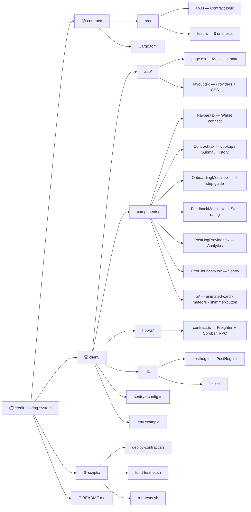

# 💳 Credit Scoring System — Stellar dApp

🌐 **Live Demo:** [https://my-credit-scoring-1.vercel.app](https://my-credit-scoring-1.vercel.app)

📋 **User Feedback Form:** [Fill out on Google Forms](https://forms.gle/6hdSkpKgnYBqzp7J6) | [View Responses (10+)](https://docs.google.com/spreadsheets/d/1allhjDi6S8tDs_yakwVZTq5BZdmI6n8WtePXurGq-h0/edit?usp=sharing)

> A fully decentralized, permissionless credit scoring system built on **Soroban smart contracts** on the **Stellar blockchain**. Any wallet can rate any other wallet (0–1000), scores are averaged on-chain, and a score is only considered "trusted" once 3+ independent evaluators agree.

---

## 📌 Project Description

This dApp lets anyone submit and look up credit scores on-chain — without relying on centralized authorities like banks or credit bureaus. It uses a **multi-evaluator weighted average** model, stores all data immutably on the Stellar testnet, and is permissionless by design.

**Key properties:**
- No admin, no login, no KYC
- Scores are public and auditable
- Anti-gaming: a score only becomes "trusted" after 3+ evaluators
- ~5s finality, <$0.01 per transaction
- Shareable score URLs (`?user=G...`)

---

## 🚀 Live Demo

| | |
|---|---|
| **Live URL** | [https://my-credit-scoring-1.vercel.app](https://my-credit-scoring-1.vercel.app) |
| **Network** | Stellar Testnet |
| **Contract Address** | `CAHR6ZKV2N7U5UMU3HQICGMNZ37YRNAXATPXQTOOPYION3RORD6C2WNR` |
| **RPC Endpoint** | `https://soroban-testnet.stellar.org` |

---

## 🛠️ Tech Stack

| Layer | Technology |
|---|---|
| Blockchain | Stellar (Soroban) — Testnet |
| Smart Contract | Rust (`soroban-sdk`) |
| Frontend | Next.js 16 (Turbopack), React 19, TypeScript |
| Styling | Tailwind CSS v4 (mobile responsive) |
| Wallet | Freighter (`@stellar/freighter-api` v6) |
| Stellar SDK | `@stellar/stellar-sdk` v14 |
| Analytics | PostHog (page views, wallet connects, contract interactions) |
| Error Monitoring | Sentry (error tracking, session replay) |
| Deployment | Vercel (frontend), Stellar Testnet (contract) |
| RPC | `https://soroban-testnet.stellar.org` |

---

## 📂 Project Structure



---

## 🏗️ System Architecture

```
┌─────────────────────────────────────────────────────────────────┐
│                        Browser                                   │
│                                                                  │
│  ┌───────────────────────┐     ┌──────────────────────────────┐ │
│  │   Next.js Frontend    │────▶│  Freighter Wallet Extension  │ │
│  │  (React + TypeScript) │◀────│  (sign transactions)         │ │
│  └──────────┬────────────┘     └──────────────────────────────┘ │
│             │                                                    │
│  ┌──────────▼────────────┐                                       │
│  │  PostHog + Sentry     │  (analytics & error monitoring)       │
│  └───────────────────────┘                                       │
└─────────────┼────────────────────────────────────────────────────┘
              │ HTTPS (Soroban RPC calls)
              ▼
┌─────────────────────────────────────────────────────────────────┐
│            soroban-testnet.stellar.org (RPC Node)               │
└────────────────────────────────────────────────────────┬────────┘
                                                         │
                                                         ▼
┌─────────────────────────────────────────────────────────────────┐
│                  Stellar Testnet Ledger                          │
│                                                                  │
│   ┌─────────────────────────────────────────────────────────┐   │
│   │          Smart Contract (Rust / WASM)                   │   │
│   │  submit_score(user, score, evaluator)                   │   │
│   │  get_scores(user) → Vec<ScoreEntry>                     │   │
│   │  get_average_score(user) → u32                          │   │
│   │  get_average_score_if_threshold(user, min) → u32        │   │
│   │  get_evaluator_count(user) → u32                        │   │
│   └─────────────────────────────────────────────────────────┘   │
└─────────────────────────────────────────────────────────────────┘
```

---

## 🧠 Smart Contract — Deep Dive

### Data Model

```rust
pub struct ScoreEntry {
    pub evaluator: Address,   // who submitted the score
    pub score: u32,           // 0–1000
    pub timestamp: u64,       // ledger timestamp at submission
}
```

### Contract Methods

| Method | Type | Description |
|---|---|---|
| `submit_score(user, score, evaluator)` | Write | Submit or update a score. Requires evaluator auth. Score must be 0–1000. |
| `get_scores(user)` | Read | Returns all `ScoreEntry` records for a user. |
| `get_evaluator_count(user)` | Read | Number of unique evaluators who have rated the user. |
| `get_average_score(user)` | Read | Average score across all evaluators. |
| `get_average_score_if_threshold(user, min)` | Read | Average score only if evaluator count ≥ min. Returns 0 otherwise. |

### Score Rating Scale

| Range | Label |
|---|---|
| 800–1000 | Excellent |
| 700–799 | Good |
| 600–699 | Fair |
| 400–599 | Poor |
| 0–399 | Very Poor |

---

## 🔗 Deployed Smart Contract

| | |
|---|---|
| **Network** | Stellar Testnet |
| **Contract Address** | `CAHR6ZKV2N7U5UMU3HQICGMNZ37YRNAXATPXQTOOPYION3RORD6C2WNR` |
| **RPC Endpoint** | `https://soroban-testnet.stellar.org` |
| **Explorer** | [View on Stellar Expert](https://stellar.expert/explorer/testnet/contract/CAHR6ZKV2N7U5UMU3HQICGMNZ37YRNAXATPXQTOOPYION3RORD6C2WNR) |

---

## 🖥️ Screenshots

### Product UI


### Smart Contract Deployment


### Analytics & Monitoring


### Mobile Responsive Design


---

## 👤 User Onboarding Flow

New users see a **4-step guided onboarding modal** on first visit:

1. **Install Freighter** — link to freighter.app, explains what it is
2. **Connect Wallet** — inline "Connect Wallet Now" button, tips on switching to Testnet
3. **Fund With Testnet XLM** — link to Stellar Friendbot, step-by-step instructions
4. **Submit or Look Up Scores** — explains the scoring system and threshold rule

The onboarding is persisted in `localStorage` so it only shows once. Users can reopen it via the **Guide** button in the navbar or the "How it works" link in the footer.

---

## 📊 Analytics & Monitoring

### PostHog Events Tracked

| Event | When |
|---|---|
| `$pageview` | Every page load / navigation |
| `wallet_connected` | When user connects Freighter |
| `wallet_disconnected` | When user disconnects |
| `contract_lookup_score` | When user looks up a credit score |
| `contract_submit_score` | When user submits a score on-chain |
| `contract_get_history` | When user fetches full history |
| `onboarding_step` | Each step of the onboarding flow |
| `feedback_submitted` | When user submits the feedback form |

### Sentry Integration

- Client-side error boundary catches React rendering errors
- Server and edge configs for full-stack coverage
- Session replay enabled on errors (`replaysOnErrorSampleRate: 1.0`)

### Setup

Copy `.env.example` to `.env.local` and fill in your PostHog key and Sentry DSN:

```bash
cp client/.env.example client/.env.local
# Edit .env.local with your keys
```

---

## 💬 User Feedback

A persistent **floating feedback button** appears in the bottom-right corner. Users can:
- Rate the app 1–5 stars (emoji scale)
- Leave a text comment (optional)
- Provide their email (optional)

Responses are tracked as `feedback_submitted` events in PostHog. After submitting, the form dismisses and a thank-you message is shown. The form only appears once per browser session (persisted in `localStorage`).

### Collected Feedback (10+ responses)

- 📝 **Feedback Form:** [forms.gle/6hdSkpKgnYBqzp7J6](https://forms.gle/6hdSkpKgnYBqzp7J6)
- 📊 **All Responses:** [View on Google Sheets](https://docs.google.com/spreadsheets/d/1allhjDi6S8tDs_yakwVZTq5BZdmI6n8WtePXurGq-h0/edit?usp=sharing)

---

## ⚙️ Setup & Installation

### Prerequisites

- [Node.js](https://nodejs.org/) v20.9+
- [Rust](https://rustup.rs/) + `wasm32-unknown-unknown` target
- [Stellar CLI](https://developers.stellar.org/docs/tools/developer-tools/cli/install-stellar-cli) (`stellar`)
- [Freighter Wallet](https://freighter.app/) browser extension (set to **Testnet**)

### 1️⃣ Clone the repository

```bash
git clone https://github.com/ankit7960/credit-scoring-system.git
cd credit-scoring-system
```

### 2️⃣ Set up environment variables

```bash
cp client/.env.example client/.env.local
# Edit .env.local with your PostHog and Sentry keys
```

### 3️⃣ Run the frontend

```bash
cd client
npm install
npm run dev
```

Open [http://localhost:3000](http://localhost:3000) in your browser.

### 4️⃣ (Optional) Deploy the contract

```bash
./scripts/deploy-contract.sh --secret <YOUR_SECRET_KEY>
```

Then update `CONTRACT_ADDRESS` in `client/hooks/contract.ts`.

### 5️⃣ Run contract tests

```bash
./scripts/run-tests.sh
# or: cd contract && cargo test
```

All 8 unit tests should pass.

---

## 🦊 Connecting Your Wallet

1. Install [Freighter](https://freighter.app/) from the Chrome/Firefox extension store
2. Create or import a Stellar account
3. Switch Freighter to **Testnet** (Settings → Network → Testnet)
4. Fund your testnet account:
   - Via script: `./scripts/fund-testnet.sh <YOUR_G...ADDRESS>`
   - Or visit: [Stellar Laboratory Friendbot](https://laboratory.stellar.org/#account-creator?network=test)
5. Click **Connect** in the app navbar — Freighter will prompt for access

---

## 🎥 Demo Video

[](https://www.loom.com/share/fe542c9d3ec44064aeda35fcf7848c4e)

**[Watch on Loom →](https://www.loom.com/share/fe542c9d3ec44064aeda35fcf7848c4e)**

The demo covers:
1. App loads — onboarding modal appears
2. Connect Freighter wallet
3. Fund with Friendbot
4. Submit a credit score (sign with Freighter)
5. Look up the score
6. Show PostHog analytics dashboard

---

## 👥 Proof of 10+ User Interactions

> After sharing the live link and collecting wallet interactions, add transaction hashes here.
> You can find them on [Stellar Expert Testnet](https://stellar.expert/explorer/testnet).

| # | Wallet (truncated) | Transaction Hash | Action |
|---|---|---|---|
| 1 | GBMY...7UCG | `4c3d507aa600a7db6d4dfb9e5e84dc0498b71f98a6b494d1fda6833d194bd6e4` | submit_score (820) |
| 2 | GAS3...FID2 | `6027352885f2eb48bf75896e5cea5fa5dcc9ad6872edd5e9831309f987cbdebb` | submit_score (750) |
| 3 | GBW4...XHED | `69daa70823e32cfe92a8ec705bcd7f73fd78f5b93b4a096dbb14ee2275c9e256` | submit_score (680) |
| 4 | GDS5...GWHJ | `5fa9b8ce00fe169023b139207ab8966324c85a84f768b1a13af7985d78ce81cc` | submit_score (910) |
| 5 | GDYV...FRLY | `7a4285e570a422a2c19f76d84002f0e3d649dd67bbed4fadcee87fe457d5ba70` | submit_score (540) |
| 6 | GAGL...SJ26 | `8999955c5f185932af42d02732bae49d53dc7074db81c67a58baac621afa4d18` | submit_score (770) |
| 7 | GCB6...ECXW | `53966d0b0ee05b39f0706a713834cfa5d5d06733caad544779abbe81d2164eba` | submit_score (830) |
| 8 | GB7D...54DR | `d1acb8194595473ab8e0245d57ab0ecdd41f839648d2dd320439a16259509aa2` | submit_score (600) |
| 9 | GDPU...JKWF | `857da1ceadde640010efd1969b4518a635a9cbbc605857598b89c687dbacb299` | submit_score (720) |
| 10 | GBJB...TBUD | `b5197eea090cdbc3eb65bb00d9eada866a61c8f997aaf37d06b1781ae6d313f4` | submit_score (880) |

> Target user scored by all 10 evaluators: `GATKS6ZEKEY6CSBARSZDEX5KI3IR5SJCKJUVEHIHT5BOK73FZMPP7D4T`
> [Verify all transactions on Stellar Expert](https://stellar.expert/explorer/testnet/contract/CAHR6ZKV2N7U5UMU3HQICGMNZ37YRNAXATPXQTOOPYION3RORD6C2WNR)

---

## 🌍 Future Improvements

- AI-based credit scoring trained on on-chain activity
- Integration with DeFi lending protocols (gated by score threshold)
- Multi-chain support (EVM + Stellar bridge)
- Historical score timeline / charts
- Mobile app (React Native + Freighter mobile)
- Reputation staking — evaluators put up collateral
- Email/push notifications for score changes

---

## 📬 Contact

| | |
|---|---|
| **Name** | Ankit Patel |
| **Email** | ankitpatel79600@gmail.com |
| **GitHub** | [github.com/ankit7960](https://github.com/ankit79600) |
| **LinkedIn** | [linkedin.com/in/ankitpatel79600](https://www.linkedin.com/in/ankitpatel79600) |

---

## 📄 License

MIT License — feel free to fork and build on this.

---

⭐ If you find this useful, give it a star!
