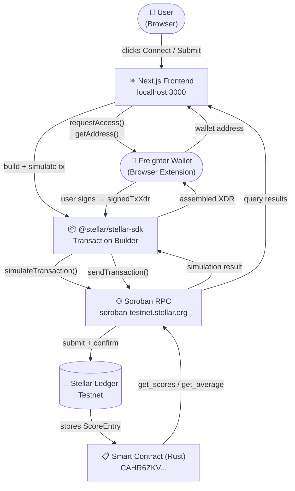

# 💳 Credit Scoring System (Soroban Smart Contract)

🌐 **Live Demo:** [https://my-credit-scoring-1.vercel.app](https://my-credit-scoring-1.vercel.app)

## 📌 Project Description

This project is a **decentralized credit scoring system** built using **Soroban smart contracts on the Stellar blockchain**. It allows any wallet to submit and retrieve credit scores transparently and securely — without relying on centralized authorities like banks or credit bureaus.

The system uses a **multi-evaluator model**: multiple parties can independently rate a user's creditworthiness, and the contract computes a weighted average on-chain. A score is only considered "trusted" once at least 3 independent evaluators have submitted — preventing single-party manipulation.

---

## 🚀 What It Does

- Any wallet can **submit a credit score** (0–1000) for any other wallet address
- Each evaluator can only hold **one active score per user** — re-submitting updates the previous entry
- Anyone can **look up** a user's evaluator count, average score, and full score history
- A **threshold check** (`get_average_score_if_threshold`) prevents single-evaluator gaming — returns 0 if fewer than N evaluators have rated the user
- All data is **immutably stored on-chain** with ledger timestamps
- **Shareable URLs** — lookup results sync to `?user=<address>` so you can share a direct link to any score profile

---

## ✨ Features

- 🔐 **Decentralized & permissionless** — no admin, no login, no KYC
- ⚡ **Fast & cheap** — ~5 second finality, transactions cost less than $0.01
- 📊 **Multi-evaluator scoring** — average across all independent raters
- 🛡️ **Anti-gaming threshold** — scores are "unverified" until 3+ evaluators agree
- 👤 **Wallet-based identity** — your Stellar public key is your identity
- 🔎 **Publicly verifiable** — anyone can audit any user's score history
- 🔗 **Shareable score links** — URL auto-updates with the queried address
- 📋 **One-click copy** — copy any address or the contract address from the UI

---

## 🛠️ Tech Stack

| Layer | Technology |
|---|---|
| Blockchain | Stellar (Soroban) — Testnet |
| Smart Contract | Rust (`soroban-sdk`) |
| Frontend | Next.js 16 (Turbopack), React 19, TypeScript |
| Styling | Tailwind CSS v4 |
| Wallet | Freighter (`@stellar/freighter-api` v6) |
| Stellar SDK | `@stellar/stellar-sdk` v14 |
| RPC | `https://soroban-testnet.stellar.org` |

---

## 📂 Project Structure

```
├── contract/
│   └── contracts/contract/
│       ├── src/
│       │   ├── lib.rs        # Contract logic (submit, get, average, threshold)
│       │   └── test.rs       # Unit tests (8 test cases)
│       └── Cargo.toml
├── client/
│   ├── app/
│   │   ├── page.tsx          # Root page — wallet state management
│   │   └── layout.tsx
│   ├── components/
│   │   ├── Navbar.tsx         # Wallet connect/disconnect, network badge
│   │   ├── Contract.tsx       # 3-tab UI: Lookup / Submit / History
│   │   └── ui/
│   │       ├── animated-card.tsx
│   │       ├── meteors.tsx
│   │       ├── spotlight.tsx
│   │       ├── shimmer-button.tsx
│   │       └── badge.tsx
│   ├── hooks/
│   │   └── contract.ts        # Freighter wallet + Soroban RPC integration
│   └── lib/
│       └── utils.ts
└── README.md
```

---

## 🏗️ System Architecture

### How it all fits together



---

### Read vs Write flow

| Action | Flow |
|---|---|
| **Lookup / History** (read) | Frontend → SDK → RPC `simulateTransaction` → Contract → result decoded back |
| **Submit Score** (write) | Frontend → SDK → RPC simulate → Freighter signs → RPC `sendTransaction` → poll until confirmed |

Read-only calls use a random keypair (no wallet needed) so anyone can look up scores without connecting.

---

### ASCII Architecture (text fallback)

```
┌─────────────────────────────────────────────────────────────────┐
│                        Browser                                   │
│                                                                  │
│  ┌───────────────────────┐     ┌──────────────────────────────┐ │
│  │   Next.js Frontend    │────▶│  Freighter Wallet Extension  │ │
│  │  (React + TypeScript) │◀────│  (sign transactions)         │ │
│  └──────────┬────────────┘     └──────────────────────────────┘ │
│             │                                                    │
└─────────────┼────────────────────────────────────────────────────┘
              │ HTTPS (Soroban RPC calls)
              ▼
┌─────────────────────────────────────────────────────────────────┐
│            soroban-testnet.stellar.org (RPC Node)               │
│                                                                  │
│   simulateTransaction()  ──────────────────────────────────┐    │
│   sendTransaction()      ──────────────────────────────┐   │    │
│   getTransaction()       (poll for confirmation)       │   │    │
└────────────────────────────────────────────────────────┼───┼────┘
                                                         │   │
                                                         ▼   ▼
┌─────────────────────────────────────────────────────────────────┐
│                  Stellar Testnet Ledger                          │
│                                                                  │
│   ┌─────────────────────────────────────────────────────────┐   │
│   │            Smart Contract (Rust / WASM)                 │   │
│   │                                                         │   │
│   │  submit_score(user, score, evaluator)                   │   │
│   │  get_scores(user) → Vec<ScoreEntry>                     │   │
│   │  get_average_score(user) → u32                          │   │
│   │  get_average_score_if_threshold(user, min) → u32        │   │
│   │  get_evaluator_count(user) → u32                        │   │
│   │                                                         │   │
│   │  Storage: instance storage, TTL 30–90 days              │   │
│   └─────────────────────────────────────────────────────────┘   │
└─────────────────────────────────────────────────────────────────┘
```

---

## 🧠 Smart Contract — Deep Dive

### Data Model

```rust
pub struct ScoreEntry {
    pub evaluator: Address,   // who submitted the score
    pub score: u32,           // 0–1000
    pub timestamp: u64,       // ledger timestamp at submission
}
```

Scores are stored per user under the key `DataKey::Scores(user_address)` in **instance storage** with a TTL that is extended to up to 90 days on every write.

### Contract Methods

| Method | Type | Description |
|---|---|---|
| `submit_score(user, score, evaluator)` | Write | Submit or update a score. Requires evaluator auth. Score must be 0–1000. |
| `get_scores(user)` | Read | Returns all `ScoreEntry` records for a user. |
| `get_evaluator_count(user)` | Read | Number of unique evaluators who have rated the user. |
| `get_average_score(user)` | Read | Average score across all evaluators. Returns 0 if no scores. |
| `get_average_score_if_threshold(user, min)` | Read | Average score only if evaluator count ≥ min. Returns 0 otherwise. |

### Score Rating Scale

| Range | Label |
|---|---|
| 800–1000 | Excellent |
| 700–799 | Good |
| 600–699 | Fair |
| 400–599 | Poor |
| 0–399 | Very Poor |

### Anti-Gaming Design

The UI flags any score with fewer than 3 evaluators as **"Low confidence / Unverified"**. The contract exposes `get_average_score_if_threshold` for callers that want to enforce this rule programmatically (e.g. a lending protocol that only accepts scores with 3+ evaluators).

---

## 🔗 Deployed Smart Contract

| | |
|---|---|
| **Network** | Stellar Testnet |
| **Contract Address** | `CAHR6ZKV2N7U5UMU3HQICGMNZ37YRNAXATPXQTOOPYION3RORD6C2WNR` |
| **RPC Endpoint** | `https://soroban-testnet.stellar.org` |

---

## 🖼️ Frontend Preview

### 🔹 UI Screenshot


---

## 🧾 Smart Contract Deployment Proof

### 🔹 Contract Address Screenshot


---

## ⚙️ How to Run Locally

### Prerequisites

- [Node.js](https://nodejs.org/) v20.9+
- [Rust](https://rustup.rs/) + `wasm32-unknown-unknown` target
- [Stellar CLI](https://developers.stellar.org/docs/tools/developer-tools/cli/install-stellar-cli) (`stellar` or `soroban`)
- [Freighter Wallet](https://freighter.app/) browser extension set to **Testnet**

---

### 1️⃣ Clone the repository

```bash
git clone https://github.com/ankit7960/credit-scoring-system.git
cd credit-scoring-system
```

### 2️⃣ Run the frontend

```bash
cd client
npm install
npm run dev
```

Open [http://localhost:3000](http://localhost:3000) in your browser.

---

### 3️⃣ (Optional) Build & redeploy the contract

```bash
cd contract
stellar contract build

stellar contract deploy \
  --wasm target/wasm32-unknown-unknown/release/contract.wasm \
  --network testnet \
  --source <your-secret-key>
```

Update `CONTRACT_ADDRESS` in `client/hooks/contract.ts` with the new address.

### 4️⃣ Run contract tests

```bash
cd contract
cargo test
```

All 8 unit tests should pass — covering submit, update, average, threshold, empty state, and timestamp recording.

---

## 🦊 Connecting Your Wallet

1. Install [Freighter](https://freighter.app/) from the Chrome/Firefox extension store
2. Create or import a Stellar account
3. Switch Freighter to **Testnet** (Settings → Network → Testnet)
4. Fund your testnet account via [Stellar Laboratory Friendbot](https://laboratory.stellar.org/#account-creator?network=test)
5. Click **Connect** in the app navbar — Freighter will prompt for access

---

## 🌍 Future Improvements

- AI-based credit scoring model trained on on-chain activity
- Integration with DeFi protocols (lending gates based on score threshold)
- Multi-chain support (EVM + Stellar bridge)
- Historical score timeline / charts
- User dashboard with analytics and notifications
- Mobile app (React Native + Freighter mobile)
- Reputation staking — evaluators put up collateral to back their ratings

---

## 📬 Contact

| | |
|---|---|
| **Name** | Ankit Patel |
| **Email** | ankitpatel79600@gmail.com |
| **GitHub** | [github.com/ankit7960](https://github.com/ankit79600) |
| **LinkedIn** | [linkedin.com/in/ankitpatel79600](https://www.linkedin.com/in/ankitpatel79600) |

---

## 📄 License

This project is licensed under the MIT License.

---

⭐ If you like this project, give it a star!
